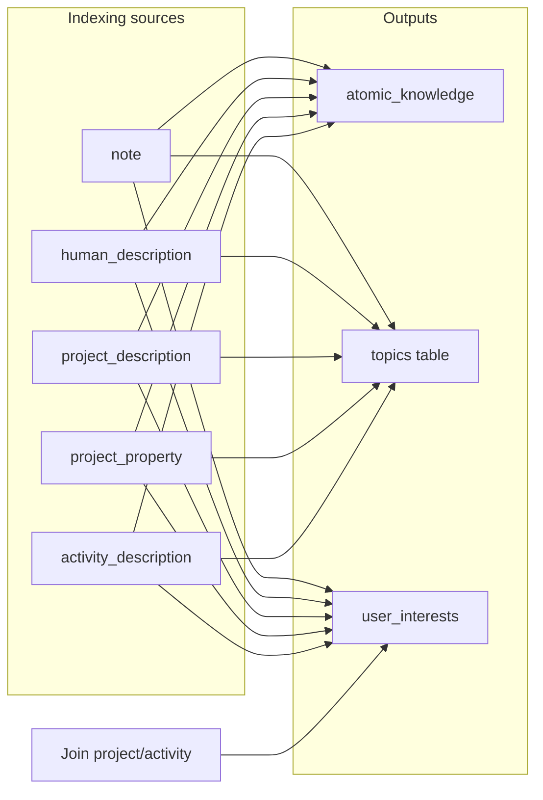

# Indexing and Interest Tracking

> **Update this doc when adding or changing any indexing source type, extraction flow, or interest weight.**

## Overview

The system indexes **atomic knowledge**, **asks**, and **topics** from various sources (notes, human/project/activity descriptions, project properties). It also updates **user interests** (topic scores) when content is indexed or when users join projects/activities.

---

## Source types

| Source type | Trigger | Model | Assigned human | Assigned project | Creator interests |
|-------------|---------|-------|----------------|------------------|-------------------|
| `note` | Note creation/indexing | gpt-4o-search-preview (web search) | Owner's human portfolio | Assigned project portfolios | Yes (weight 0.1) |
| `human_description` | Human portfolio description save | gpt-4o-search-preview (web search) | That human portfolio | — | Yes (weight 3) |
| `project_description` | Project description save | gpt-4o-search-preview (web search) | Owner's human portfolio | That project | Yes (weight 0.1) |
| `project_property` | Project goals/timelines/asks save | gpt-4o-search-preview (web search) | Owner's human portfolio | That project | Yes (weight 0.1) |
| `activity_description` | Activity description save | gpt-4o-search-preview (web search) | Creator's human (non-external only) | — | Yes for non-external only (weight 0.1) |

---

## Interest weights

| Event | Weight |
|-------|--------|
| Human description indexed | **3** (personal) |
| Project description indexed | **0.1** |
| Project property (goals/timelines/asks) indexed | **0.1** |
| Activity description indexed (non-external only) | **0.1** |
| Note posted | **0.1** |
| User joins project or activity | **0.1** (topics from portfolio added to joining user) |

---

## When interests are updated

1. **After indexing** — Creator/owner gets interests updated (human: 3; project, activity, note: 0.1). Activity: only for non-external activities.
2. **After posting a note** — Note owner gets interests with weight 0.1.
3. **When a user joins a project or activity** — Joining user gets the portfolio's existing topic IDs (from `metadata.description_topics` or derived from `atomic_knowledge`) added with weight 0.1.

---

## External vs non-external activity

- **External activity** (`metadata.properties.external === true`, has `external_link`): Topics and atomic knowledge are still extracted and indexed (with web search when the external link is passed). `assigned_human` is left **empty**. Creator interests are **not** updated.
- **Non-external activity**: Tied to creator's human portfolio (`assigned_human`). Creator gets interest update with weight 0.1. Topic IDs are stored in `metadata.description_topics` for join-flow interest updates.

---

## Join-flow topic source

When a user joins a project or activity, topic IDs are taken from the portfolio's **existing** index:

- **Primary:** `metadata.description_topics` (set when project/activity description is indexed).
- **Fallback:** If missing (e.g. old data), topic IDs are derived from `atomic_knowledge` rows where `source_type` is `project_description` or `activity_description` and `source_id` is the portfolio ID; distinct `topics` from those rows are merged.

Helper: `getTopicIdsForPortfolio(portfolioId)` in [lib/indexing/interest-tracking.ts](../lib/indexing/interest-tracking.ts). Join interest update: `addPortfolioTopicsToUserInterests(portfolioId, userId)` (weight 0.1).

---

## Note indexing (asks)

Note indexing ([app/api/index-note/route.ts](../app/api/index-note/route.ts)) uses `extractFromCompoundText`, which extracts **summary**, **atomic knowledge**, **topics**, and **asks**. Both atomic knowledge (non-asks) and asks are stored via `storeAtomicKnowledge` with `source_type: 'note'`.

---

## Backfill scripts

- **Activity indexing:** [scripts/backfill-activity-indexing.ts](../scripts/backfill-activity-indexing.ts) — runs `processActivityDescription` for all existing activity portfolios. Run once after deploying activity indexing. Usage: `npx tsx scripts/backfill-activity-indexing.ts` (from project root with env loaded).
- **Project description_topics:** [scripts/backfill-project-description-topics.ts](../scripts/backfill-project-description-topics.ts) — for each project, derives distinct topic IDs from `atomic_knowledge` rows with `source_type: 'project_description'` and sets `metadata.description_topics`. Run once for projects indexed before description_topics persistence. Usage: `npx tsx scripts/backfill-project-description-topics.ts`.

---

## Flow (overview)

Weights and “external = no assigned_human / no creator UI” are described in the sections above.
